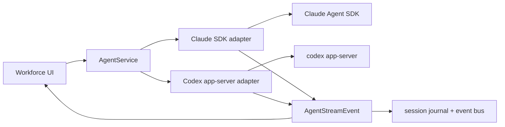

# Codex Integration Draft

## Recommendation

Add Codex as a second provider behind Workforce's existing agent-service boundary, starting with the Codex app-server protocol and using t3code plus craft-agents-oss as implementation references. The current Claude path already owns streaming normalization, approval prompts, warm session reuse, cancellation, and journaling in `src/services/agent.ts` plus `src/services/sdk-adapter.ts`; Codex should plug into that shape rather than reintroduce a broad provider abstraction like `unifai`.

## Current Status

Unifai deprecation is functionally complete in the repo:

- `lib/unifai` is absent and `.gitmodules` only lists the remaining submodules.
- `package.json` workspaces no longer include `lib/unifai`.
- `tsconfig.json`, Vite/Vitest aliases, and `tooling/path-aliases.ts` no longer map `"unifai"`.
- Runtime code has no `unifai` imports; the remaining matches were stale docs.
- `src/services/agent.ts` runs directly through `runSDKQuery(...)`.
- `src/services/sdk-adapter.ts` is the current provider boundary for Claude Agent SDK event mapping.

The local Codex app-server POC also works against `codex-cli 0.128.0` when run
outside the worktree sandbox so it can write normal Codex state:

- initialized app-server over stdio.
- opened provider thread `019e0f40-68d3-7f21-adb0-05beb5541840`.
- sent a text-only turn.
- received the sentinel response `workforce-codex-poc-ok`.
- observed native notifications: `thread/started`, `turn/started`, `item/started`, `item/agentMessage/delta`, `item/completed`, `turn/completed`, `thread/status/changed`, `thread/tokenUsage/updated`, `account/rateLimits/updated`, `mcpServer/startupStatus/updated`, `remoteControl/status/changed`, `skills/changed`, and `warning`.

## Source Guidance

OpenAI's Codex docs expose two integration surfaces that matter here:

- `codex app-server` for app-native JSON-RPC over stdio.
- `codex mcp-server` for generic MCP clients.

t3code and craft-agents-oss both point toward app-server as the stronger product integration surface. t3code runs `codex app-server` per provider session and wraps it behind a provider adapter with start, send turn, interrupt, approval, user-input, thread-read, rollback, and event-stream operations. craft-agents-oss has the same direction: its Codex app-server client calls out pre-tool approval, thread persistence, and built-in auth handling as key features over exec mode.

MCP remains useful for a tiny spike or for compatibility with generic MCP hosts, but it is not the recommended primary path for Workforce's own desktop runtime.

OpenAI's Agents SDK guidance says the SDK track is best when the application server owns orchestration, tool execution, state, approvals, custom storage, and product integration. Workforce has that shape. The Codex app-server path keeps Codex's local runtime intact while Workforce continues to own session records, review surfaces, and approval UI.

## Shape



## Provider Boundary

Introduce a small `AgentProvider` interface, not a generic multi-provider framework:

```ts
interface AgentProvider {
  readonly id: "claude" | "codex";
  run(prompt: string, options?: RunOptions): StreamResult<AgentStreamEvent>;
  cancel(): Promise<void> | void;
}
```

Keep existing Claude behavior as the default provider. Extract only the minimum needed from `AgentServiceImpl` once Codex requires it:

- shared run lifecycle: one active run, abort state, pending questions
- provider selection: org/template/session config chooses `"claude"` or `"codex"`
- model catalog: provider-scoped model IDs and display names
- common stream contract: `AgentStreamEvent` stays UI-facing

Do not start by renaming all Claude-specific internals. Rename only when Codex has a concrete caller.

## Codex Adapter

Create `src/services/codex-adapter.ts` that starts or connects to `codex app-server` and speaks JSON-RPC over stdio:

- start a provider-backed session with `thread/start` or `thread/resume`.
- send turns with `turn/start`.
- interrupt with `turn/interrupt`.
- support approval and structured user-input request/response messages.
- read and rollback threads if Workforce exposes those controls.
- store the Codex provider thread ID as provider session metadata.
- map app-server notifications into `AgentStreamEvent` first, then preserve native event logs for debugging.

Initial config mapping:

| Workforce field | Codex app-server field |
| --- | --- |
| `prompt` | `turn/start` input |
| `process.cwd()` / session cwd | thread/session cwd |
| `permissionMode: "plan"` | read-only/safe runtime mode plus plan instructions |
| `permissionMode: "default"` | workspace-write with request approvals |
| `permissionMode: "acceptEdits"` | workspace-write with edit approvals tuned by policy |
| `permissionMode: "bypassPermissions"` | require explicit user opt-in before mapping to broader sandbox |
| `model` | `model` |
| `systemPrompt` | app-server config/developer instruction layer |

## Reference Lessons

t3code should guide the provider-service shape:

- provider-specific adapters own runtime protocol details only.
- the shared provider service owns routing, session lookup, event fan-out, and metrics.
- provider sessions can start before a provider thread ID is known; resolve the provider thread ID asynchronously.
- direct app-server operations are valuable beyond chat: interrupt, approvals, user input, thread read, and rollback.

craft-agents-oss should guide the workspace context shape:

- keep sources, skills, files, folders, and workspace mentions outside the low-level provider adapter.
- normalize provider output into a shared event contract, then project it into UI state.
- keep app-server native events available for debugging instead of only storing rendered chat.
- package/runtime concerns matter: Codex binary resolution, auth tokens, and app-server lifecycle need explicit smoke tests in packaged desktop builds.

## State And Persistence

Persist provider metadata next to Workforce sessions:

```ts
type ProviderSessionRef =
  | { provider: "claude"; sessionId: string }
  | { provider: "codex"; threadId: string };
```

Keep Workforce's session journal as the source of truth for UI replay. Provider-native thread IDs are resume handles, not the primary product record.

## Permissions

Keep approval flow conservative:

- Codex runs in `workspace-write` by default.
- Destructive or broad filesystem/network permissions stay behind Workforce's existing approval UI.
- `bypassPermissions` should not silently become `danger-full-access`.
- The first milestone can block unsupported Codex approval events loudly instead of approximating safety.

## Milestones

1. Provider registry: add `provider` to `RunOptions` and model config, defaulting to Claude.
2. Codex app-server spike: start `codex app-server` from a service test or script and capture initialize, thread start, turn start, approval, and completion traffic. Done for text-only turn via `bun run poc:codex`.
3. Minimal adapter: implement `codex-adapter.ts` with text streaming/turn completion and provider thread ID persistence.
4. UI selection: expose provider/model selection only where existing agent config already appears.
5. Approvals and tools: map Codex approval/progress events once verified against live app-server traffic.
6. Runtime verification: run focused service tests, type-check, lint, then a real local Codex smoke in a temp worktree.

## Open Questions

- Should the first Workforce adapter wrap raw JSON-RPC directly, or vendor a tiny app-server client module shaped like craft-agents-oss?
- Should Codex sessions share Workforce's current warm-session reuse behavior, or should every prompt use app-server `thread/resume` with stored provider thread ID?
- Which Codex models should appear in the UI by default: latest general GPT-5 model, a Codex-specialized model, or whatever the user's Codex profile selects?
- Should cloud Codex delegation be modeled now, or deferred until local Codex app-server is working end to end?

## Non-Goals

- Do not restore `unifai`.
- Do not add a provider framework before two providers are live.
- Do not replace Claude as the default path in the same branch.
- Do not wire cloud Codex before local Codex app-server has a proven runtime path.
